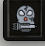

# 💀 Mode Hardcore

## 💀 Mode Hardcore

Le **mode Hardcore** est un mode de jeu à haut risque, mais avec de **gros gains** à la clé.\
Parfait pour les joueurs ambitieux qui aiment vivre dangereusement... ⚔️🔥

***

### 🧨 Activer le mode Hardcore

Tu peux activer le mode **à tout moment** via l’interface prévue.\
Une fois activé, tu passes en **mode Hardcore**, avec les règles suivantes :

<figure><figcaption></figcaption></figure>

***

### 🎁 Récompense exclusive

✅ Chaque combat **remporté** en mode Hardcore te rapporte une ressource spéciale :

#### 💎 **Les Hardcoria**

* Gagnées **automatiquement** à la fin de chaque combat.
* Peu importe la zone ou les monstres affrontés, tant que le combat est gagné **en mode Hardcoria**.

***

### 🧟 Difficulté augmentée

> ⚠️ L’IA des monstres **ne change pas**,\
> mais leurs **statistiques sont boostées** (PV, dégâts, etc).

Résultat : chaque combat devient un **véritable défi** 💥

***

### ❌ Si tu perds un combat…

Tu subis une **punition sévère** :

* **Tous tes sorts** sont supprimés, sauf ceux de base de ta classe.
* Tu dois **réapprendre** tous les autres sorts si tu veux les récupérer. Ou alors acheter une orbe de reconstitution au prêt du PNJ Merlin l'enchanteur (zone boutique au prix de 1000 ogrines)

> ⚠️ Cette perte est **irréversible**, réfléchis bien avant de te lancer !

***

### 🛍️ Que faire avec les Hardcoria ?

Tu peux les **échanger** auprès d’un **PNJ spécial** dans le jeu :

#### 📍 Où ?

Rends-toi dans le **Panneau de Téléportation** > **Zone PNJ Utile**\
→ Parle au **PNJ Hardcoria**

#### 📦 Récompenses disponibles :

* 🥚 **Dofus** spéciaux
* ⚗️ **Fusionneurs** pour les donjons Rebirth
* 💉 **Sérums d’Amélioration** pour booster ton personnage

> 🛒 Le stock évoluera avec le temps… reste à l’affût !

***

### 🧠 Pour les vrais tryharders

Le mode Hardcoria est pensé pour ceux qui veulent :

* 🔥 Relever un vrai défi
* 📈 Accélérer leur progression

À toi de prouver que tu as ce qu’il faut pour dominer Vallya… en mode HARDCORE 💀
