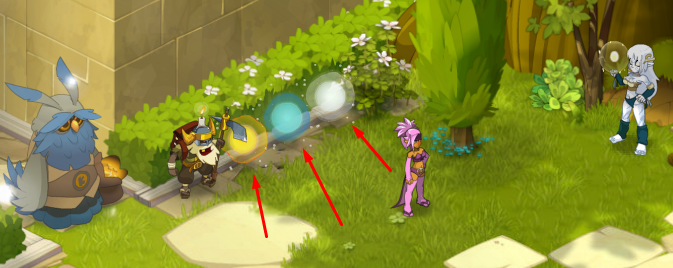
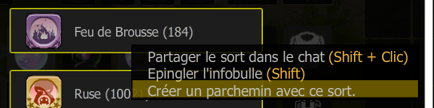

# 🎮Les Coffres de Sort

🔑 Les **coffres de sort** sont des objets spéciaux que vous pouvez obtenir en affrontant des monstres à travers le monde des Douze. Ces coffres contiennent des **parchemins de sort**, qui vous permettent d'apprendre ou d'améliorer vos compétences magiques.

***

#### 🎁 Les différents types de coffres 

<table data-view="cards"><thead><tr><th></th><th></th><th></th><th></th><th></th><th></th><th></th><th></th><th data-hidden data-card-cover data-type="files"></th></tr></thead><tbody><tr><td>Coffre : </td><td>🏅 <strong>Coffre de Sort [Commun]</strong></td><td>Apparence : </td><td>📦 Gris</td><td>Rareté : </td><td>Commun</td><td>Récompense : </td><td>Sort commun</td><td><a href="../.gitbook/assets/image.jpg">image.jpg</a></td></tr><tr><td>Coffre : </td><td>🔷 <strong>Coffre de Sort [Rare]</strong></td><td>Apparence : </td><td>📦 Bleu</td><td>Rareté : </td><td>Rare</td><td>Récompense : </td><td>Sort rare</td><td><a href="../.gitbook/assets/image1.jpg">image1.jpg</a></td></tr></tbody></table>

<table data-view="cards"><thead><tr><th></th><th></th><th></th><th></th><th></th><th></th><th></th><th></th><th data-hidden data-card-cover data-type="files"></th></tr></thead><tbody><tr><td>Coffre : </td><td>🟣 <strong>Coffre de Sort [Épique]</strong></td><td>Apparence : </td><td>📦 Violet</td><td>Rareté : </td><td>Épique</td><td>Récompense : </td><td>Sort épique</td><td><a href="../.gitbook/assets/image2.jpg">image2.jpg</a></td></tr><tr><td>Coffre : </td><td>🟡 <strong>Coffre de Sort [Légendaire]</strong></td><td>Apparence : </td><td>📦 Doré</td><td>Rareté : </td><td>Légendaire</td><td>Récompense : </td><td>Sort légendaire</td><td><a href="../.gitbook/assets/image3.png">image3.png</a></td></tr></tbody></table>

***

#### 🔄 **Échange et amélioration des coffres** 

Vous pouvez **améliorer vos coffres** en les échangeant contre des versions plus rares :

* **25 Coffres Commun** → **1 Coffre Rare**
* **50 Coffres Rare** → **1 Coffre Épique**
* **100 Coffres Épique** → **1 Coffre Légendaire**

Cela vous permet de transformer des coffres basiques en coffres plus puissants, augmentant ainsi la valeur des parchemins obtenus.

<figure><figcaption></figcaption></figure>

***

#### 🗺️ Où trouver ces coffres ? 

🎯 Ces coffres peuvent être obtenus en **drop sur tous les monstres** du monde des Douze.

***

#### 🔥 **Utilisation des coffres et des parchemins** 

1️⃣ **Ouvrir le coffre** 🎁 → Obtenez un **parchemin de sort**. 2️⃣ **Double-cliquez sur le parchemin** 📜 → Débloquez un **sort**. 3️⃣ **Gérez vos sorts** 🔄 → Vous pouvez **convertir un sort** en **parchemin échangeable** si vous souhaitez le réutiliser ou l’échanger.

<figure><figcaption></figcaption></figure>

⚠️ **Limite des sorts** : Un joueur peut posséder jusqu’à **25 sorts actifs**.

***

➡️ **"Vous trouverez la liste complète des sorts contenus dans chaque coffre dans la section "Contenu des Coffres de Sort"**
