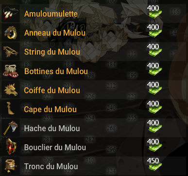

# 🌫️ Berceau d’Alma (LvL 17 500)

\
Le Berceau d’Alma est une zone redoutable où les ennemis frappent fort et sans relâche. Cette zone représente la dernière ligne droite avant le contenu ultra-endgame.\

🏆 Ressources nécessaires pour l’équipement complet\
Pour obtenir l’ensemble complet du stuff de la zone, vous aurez besoin de **4050 ressources**, avec **2 bagues**.\
\

⚠️ Aucun donjon parfaitement adapté ici, à l’exception de **Dantinéa**. Cependant, ce dernier peut s’avérer difficile à vaincre à ce stade : **n’hésite pas à y revenir plus tard** une fois mieux préparé.
