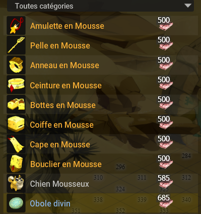

# 💀Dune des ossements Level 15000

Une zone aride et hostile, où seuls les plus robustes survivent. Les Dunes des Ossements marquent une étape importante dans ta montée en puissance.

💸 **Bonus** :

* À partir de cette zone, tu peux échanger les **Oboles** obtenues dans les zones précédentes via les **PNJs disponibles dès Sakai**
* Ces échanges se font auprès du **PNJ situé en \[-15, -56]**
* ⚠️ **Les Oboles ne sont comptabilisées dans aucun total de ressources** pour les équipements. Elles sont à part, utilisées uniquement pour des **échanges spécifiques**.

🏆 Ressources nécessaires pour l’équipement complet\
Pour obtenir l’ensemble complet du stuff de la zone, vous aurez besoin de **5085 ressources**, en prenant en compte **2 bagues**.\

🕳️ Donjon associé : **Cimetière des Mastodontes**
