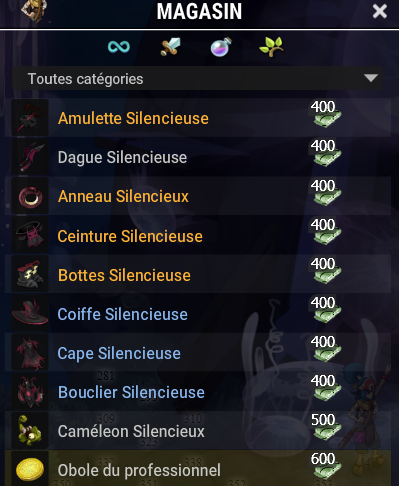

# ⚓ Épaves Silencieuses (LvL 11 500)

\
Perdue au milieu des brumes et des carcasses de bateaux, cette zone est sinistre, mais regorge de ressources précieuses. Les ennemis y sont agressifs et tenaces, à la hauteur des trésors qu’ils protègent.

🏆 Ressources nécessaires pour l’équipement complet\
Pour obtenir l’ensemble complet du stuff de la zone, vous aurez besoin d’un total de **3700 ressources**, en incluant **2 bagues**.\

🕳️ Donjon associé : **Tour de Bethel**
