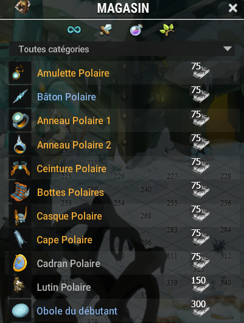

# ⚓ Port de Sakai (LvL 6000)

\
Le Port de Sakai est la première étape de ta progression vers les zones à très haut niveau. Les monstres y sont redoutables, mais les récompenses le sont tout autant. Prépare-toi à affronter des groupes coriaces pour récupérer les ressources nécessaires au prochain équipement.

🏆 Ressources nécessaires pour l’équipement complet\
Pour obtenir l’ensemble complet du stuff de la zone, vous aurez besoin d’un total de **825 ressources**, en comptant **2 bagues**.\
\

🕳️ Donjon associé : **Mine abandonnée de Sakai**
